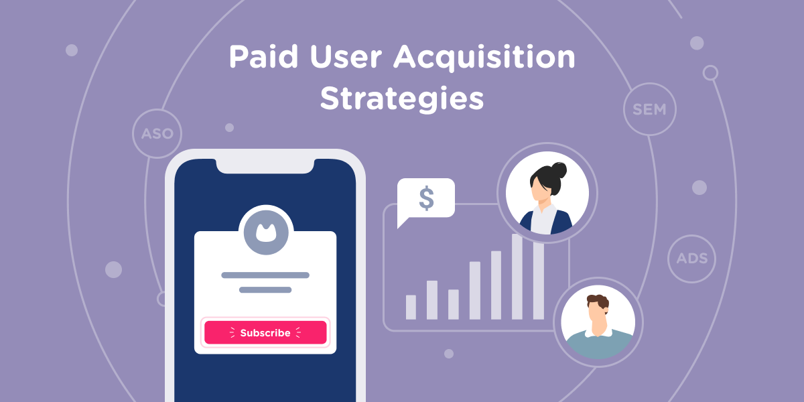

  

# Directing User Subscriptions

### Directing Users to Subscription Products via App Behavior Analysis

## Project Overview

In today's market, many companies have a mobile presence. Often, companies provide free products or services in these apps in an attempt to transition users to a paid membership. Examples of paid products that originate from free ones include YouTube Premium, Discord Nitro, Spotify Premium, Meta Verified, and You Need A Budget (YNAB). Since marketing efforts are never free, these companies need to know exactly who to target with offers and promotions.

- **Market**: The target audience is users who engaged with a company's free product. In this case study, this refers to users who installed (and used) the company's free mobile app.

- **Product**: The paid memberships. These are often enhanced versions of the free product provided, alongside additional features.

- **Goal**: The objective of this model is to predict which users will _not_ subscribe to the paid membership, so that greater marketing efforts can be applied to "convert" them to paid users.

## Business Challenge

- In this case study, the client is a fintech company that wants to provide its customers with a paid app subscription that will allow them to track all their financial data in one place. To attract customers, it has released a free version of the app with some of the main features unlocked.

- The company has asked we identify which users are _NOT_ likely to enroll in the paid product, so that additional offers can be given to them. Because of the cost of these offers, the company does not want to give them to everyone. Especially those who were going to enroll anyways.

## Data

- User App Behavior data. This data allows us to see the date & time of application installation, as well as the features the user engaged with within the app. App behavior is characterized as the list of app screens the user engaged with, and whether the user played the mini-finacial games available.

- App usage data is only from the user's first 24 hours with the app. This limitation exists because users are restricted to a 24-hour free trial period of access to premium features, and the company wants to target unsubscribed users with new offers shortly after the trial completes.

- [app-user-data.csv](./data/raw/app-user-data.csv)

---

## Source Code

- [EDA (Exploratory Data Analysis) and Feature Engineering](./notebooks/directing-user-subscriptions_eda.ipynb)

- [Data Pre-processing and Model Building](./notebooks/directing-user-subscriptions_model.ipynb)

## Experiments

- [Hyperopt Trials](./experiments/README.md)

## Data

- [Profiling Report](https://ml-fintech-case-studies.netlify.app/profile_reports/app-user-data.html#overview) of app-user-data.csv
- [Processed](./data/processed/)
