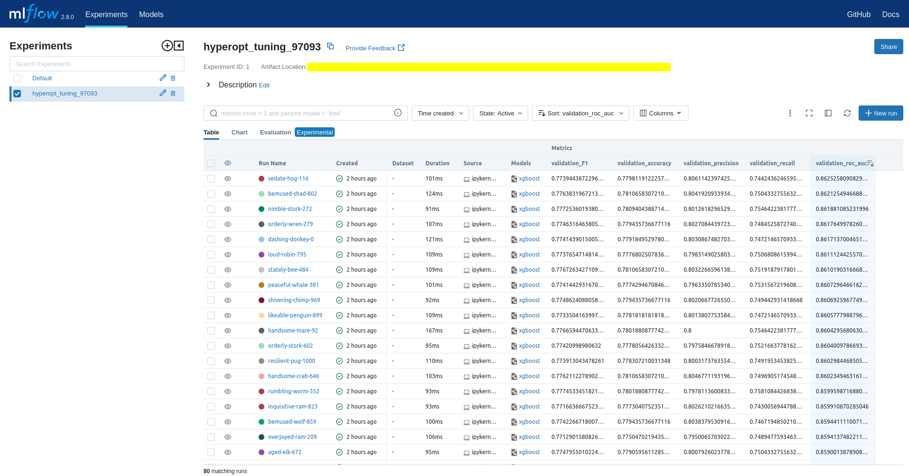

# ML experiments from _Directing User Subscriptions_ 🧪 🤖

## Algorithms

- ### [XGBoost Classifier](./mlflow_xgb/README.md)

---

## Experiment Tracking

- To utilize the [MLflow](https://mlflow.org/) UI with your experiments when using SQLite for backend storage

  Navigate in the terminal to the directory hosting the SQLite database for experiments and execute

  ```
  $ mlflow ui --backend-store-uri sqlite:///mlflow.sqlite -p 8000
  ```

  Open your browser at http://localhost:8000/

  

  **_To reduce repository size, SQLite databases and artifacts from Hyperopt trials are excluded from git_**

  For a demo of using a file directory for backend storage, visit use case [Predicting Loan E-Signatures](../../predicting-loan-signatures/README.md)
