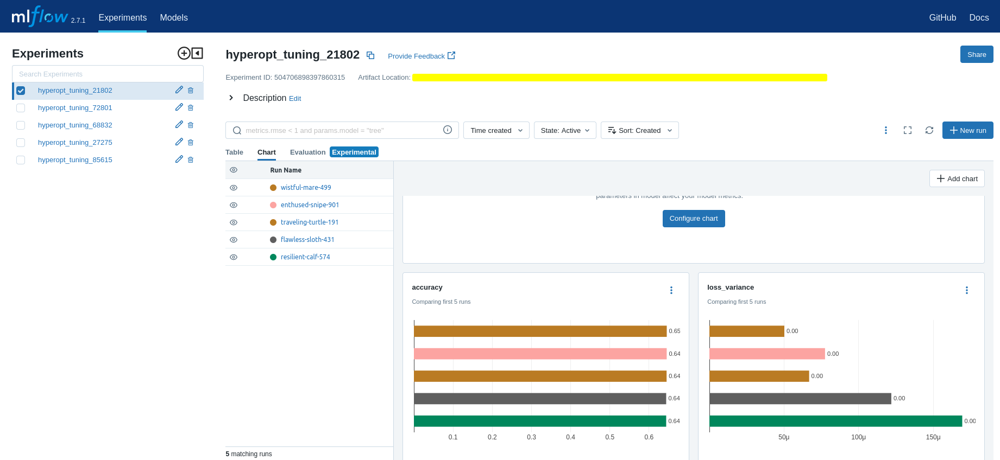

# ML experiments from _Predicting Loan E-Signatures_ 🧪 🤖

## Algorithms

- ### [Gradient Boosting Classifier](./mlflow_gbc/README.md)

- ### [Random Forest Classifier](./mlflow_rfc/README.MD)

---

## Experiment Tracking

- To utilize the [MLflow](https://mlflow.org/) UI with your experiments when using a file directory for backend storage

  ```
  $ mlflow server --backend-store-uri path/to/directory/hosting/your/experiment
  ```

  Open your browser at http://localhost:5000/

  

  **_The following files are excluded from this git repository: meta.yaml, tags_**
